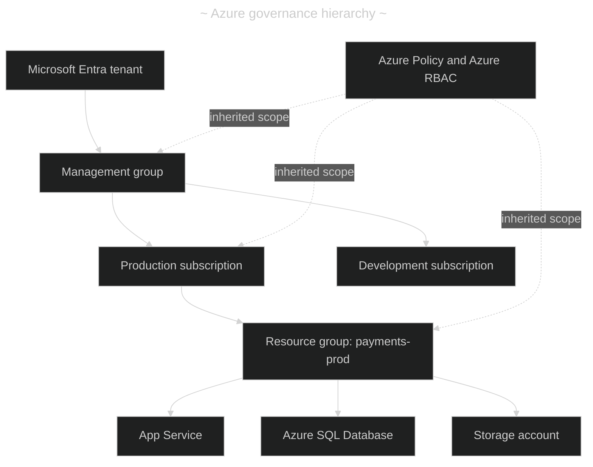
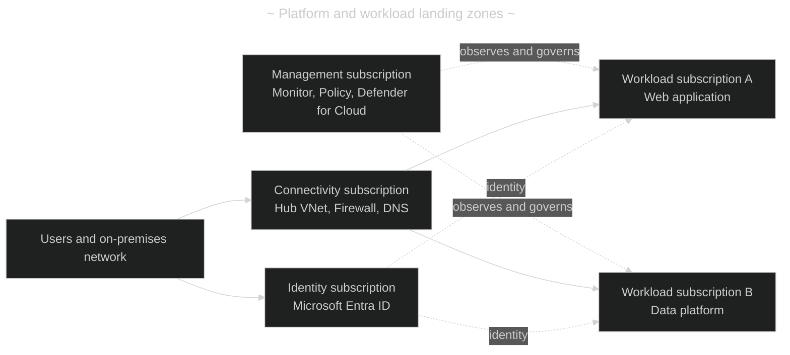
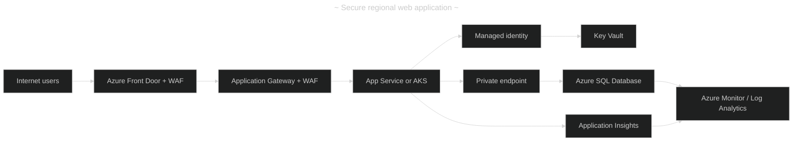
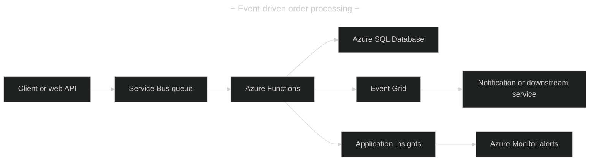

- [Azure services reference](#azure-services-reference)
  - [(1) Purpose and service model](#1-purpose-and-service-model)
  - [(2) Azure foundation and relationships](#2-azure-foundation-and-relationships)
    - [(2.1) Resource hierarchy and governance](#21-resource-hierarchy-and-governance)
    - [(2.2) Landing zone concept](#22-landing-zone-concept)
  - [(3) Core service catalogue](#3-core-service-catalogue)
    - [(3.1) Compute and application hosting](#31-compute-and-application-hosting)
    - [(3.2) Networking and edge delivery](#32-networking-and-edge-delivery)
    - [(3.3) Data, storage, and analytics](#33-data-storage-and-analytics)
    - [(3.4) Integration, identity, security, and operations](#34-integration-identity-security-and-operations)
  - [(4) Common workload patterns](#4-common-workload-patterns)
    - [(4.1) Secure web application](#41-secure-web-application)
    - [(4.2) Event-driven processing](#42-event-driven-processing)
    - [(4.3) Data platform](#43-data-platform)
  - [(5) Design guardrails](#5-design-guardrails)
  - [(6) Official learning links](#6-official-learning-links)
  - [(7) Quick selection guide](#7-quick-selection-guide)

---

# Azure services reference

---

## (1) Purpose and service model

Azure is a cloud platform composed of services that are deployed into a logical hierarchy: a Microsoft Entra tenant owns subscriptions; subscriptions contain resource groups; resource groups contain Azure resources. This hierarchy is the basis for billing, access control, policy, and lifecycle management.

| #   | Model      | Customer manages                             | Azure manages                                               | Typical use case                                   |
| --- | ---------- | -------------------------------------------- | ----------------------------------------------------------- | -------------------------------------------------- |
| 1   | IaaS       | Operating system, runtime, application, data | Datacenter hardware and virtualization                      | A legacy application requiring full server control |
| 2   | PaaS       | Application code and data                    | Operating system, runtime, scaling platform, infrastructure | A web API or database-backed application           |
| 3   | Serverless | Functions, workflow logic, data              | Servers, runtime scaling, and infrastructure                | Event-driven processing with variable demand       |
| 4   | SaaS       | Configuration, users, and data usage         | The complete application and platform                       | Microsoft 365 or Dynamics 365                      |

- IaaS: ??
- PaaS: ??
- DaaS: ??

> Choose the highest-level service that satisfies the operational requirements. Moving from VMs to PaaS or serverless generally reduces infrastructure maintenance, but can impose platform constraints.

---

## (2) Azure foundation and relationships

### (2.1) Resource hierarchy and governance

Management groups organize subscriptions. Azure Policy applies and evaluates guardrails, while Azure role-based access control (Azure RBAC) grants permissions. Inherited assignments should be designed deliberately because a higher scope affects lower scopes.

| #   | Scope or service       | Relationship                                                           | Use case                                                     |
| --- | ---------------------- | ---------------------------------------------------------------------- | ------------------------------------------------------------ |
| 1   | Microsoft Entra ID     | Identity plane for users, groups, applications, and managed identities | Centralize authentication and conditional access             |
| 2   | Management group       | Groups subscriptions for shared governance                             | Apply organization-wide policy and role assignments          |
| 3   | Subscription           | Billing, quota, and isolation boundary                                 | Separate production, development, or business units          |
| 4   | Resource group         | Lifecycle container for related resources                              | Deploy and delete one application environment together       |
| 5   | Azure Policy           | Evaluates or enforces configuration rules at a scope                   | Require tags, approved regions, and private endpoints        |
| 6   | Azure RBAC             | Authorizes actions through role assignments                            | Give a team least-privilege access to one resource group     |
| 7   | Azure Resource Manager | Control plane used by Portal, CLI, Bicep, and SDKs                     | Consistently deploy resources through infrastructure as code |

### (2.2) Landing zone concept

An Azure landing zone is the governed foundation for workloads at scale. A platform landing zone centralizes shared capabilities such as identity, connectivity, management, and security. Workload landing zones host application resources within those guardrails.

---

## (3) Core service catalogue

### (3.1) Compute and application hosting

| #   | Service                        | Relationship to other services                                                      | Best fit                                                 |
| --- | ------------------------------ | ----------------------------------------------------------------------------------- | -------------------------------------------------------- |
| 1   | Azure Virtual Machines         | Runs in a VNet; disks use managed storage; monitor with Azure Monitor               | Custom or legacy workloads needing OS control            |
| 2   | Azure App Service              | Can use managed identity, VNet integration, Key Vault, and Application Insights     | HTTP apps, APIs, and background web jobs                 |
| 3   | Azure Functions                | Triggered by HTTP, timers, Storage, Service Bus, or Event Grid                      | Short, event-driven code without server management       |
| 4   | Azure Kubernetes Service (AKS) | Uses a VNet, container registry, identity, and observability services               | Containerized microservices requiring Kubernetes control |
| 5   | Azure Container Apps           | Uses container images and scales on HTTP/events; integrates with Dapr and revisions | Container apps with less orchestration overhead than AKS |
| 6   | Azure Container Registry       | Stores images consumed by AKS, Container Apps, or App Service                       | Private container image distribution                     |
| 7   | Azure Virtual Desktop          | Depends on identity, networking, profiles, and compute                              | Securely deliver Windows desktops and apps               |

### (3.2) Networking and edge delivery

| #   | Service                         | Relationship to other services                                           | Best fit                                                       |
| --- | ------------------------------- | ------------------------------------------------------------------------ | -------------------------------------------------------------- |
| 1   | Azure Virtual Network (VNet)    | Private network foundation for VMs, AKS, private endpoints, and gateways | Network isolation and private address space                    |
| 2   | Network Security Group (NSG)    | Filters traffic at subnet or NIC level within a VNet                     | Basic allow/deny segmentation                                  |
| 3   | Azure Firewall                  | Central stateful firewall, commonly in a hub VNet                        | Central egress and east-west traffic control                   |
| 4   | Azure Application Gateway + WAF | Layer-7 reverse proxy for web apps, optionally with WAF                  | Regional HTTP(S) routing and web protection                    |
| 5   | Azure Front Door + WAF          | Global edge entry point routing to regional origins                      | Global web delivery, acceleration, and failover                |
| 6   | Azure Load Balancer             | Layer-4 distribution to VMs or VM scale sets                             | TCP/UDP traffic and high availability                          |
| 7   | Azure Private Link              | Gives a PaaS service a private endpoint in a VNet                        | Keep PaaS traffic off the public internet                      |
| 8   | VPN Gateway / ExpressRoute      | Connects on-premises networks to VNets                                   | Hybrid connectivity over VPN or dedicated private connectivity |

### (3.3) Data, storage, and analytics

| #   | Service                       | Relationship to other services                                                | Best fit                                                      |
| --- | ----------------------------- | ----------------------------------------------------------------------------- | ------------------------------------------------------------- |
| 1   | Azure Storage                 | Supplies Blob, Files, Queues, and Tables; private endpoints can secure access | Objects, files, messages, and unstructured data               |
| 2   | Azure SQL Database            | Managed relational database; apps can authenticate with Microsoft Entra ID    | Transactional SQL workloads without SQL Server administration |
| 3   | Azure SQL Managed Instance    | Managed SQL Server-compatible PaaS within a VNet                              | Migrating SQL Server with higher compatibility needs          |
| 4   | Azure Cosmos DB               | Globally distributed NoSQL database; emits change feed events                 | Low-latency, globally distributed application data            |
| 5   | Azure Database for PostgreSQL | Managed PostgreSQL PaaS, optionally privately accessed                        | PostgreSQL-based applications                                 |
| 6   | Azure Cache for Redis         | Caches data in front of application databases                                 | Reduce database latency and load                              |
| 7   | Azure Data Factory            | Orchestrates data movement and transformation pipelines                       | Scheduled or repeatable ETL/ELT workflows                     |
| 8   | Azure Databricks              | Analytics platform commonly reading from Data Lake Storage                    | Large-scale data engineering and machine learning             |
| 9   | Microsoft Fabric              | SaaS analytics platform that can consume data from Azure sources              | Integrated enterprise BI, lakehouse, and analytics            |

### (3.4) Integration, identity, security, and operations

| #   | Service                      | Relationship to other services                                            | Best fit                                                   |
| --- | ---------------------------- | ------------------------------------------------------------------------- | ---------------------------------------------------------- |
| 1   | Microsoft Entra ID           | Authenticates users, apps, and managed identities across Azure            | Identity, SSO, and workload authentication                 |
| 2   | Azure Key Vault              | Stores secrets, keys, and certificates; accessed through managed identity | Remove credentials from application configuration          |
| 3   | Azure Service Bus            | Reliable queues and topics between producers and consumers                | Decoupled business workflows and ordered/reliable messages |
| 4   | Azure Event Grid             | Pushes lightweight event notifications to subscribers                     | Reactive automation for resource and Blob events           |
| 5   | Azure API Management         | Publishes, secures, throttles, and observes APIs                          | A governed API gateway for internal or external consumers  |
| 6   | Azure Logic Apps             | Low-code workflow service with connectors                                 | SaaS, B2B, or approval integrations                        |
| 7   | Azure Monitor                | Collects metrics, logs, traces, and alerts across Azure resources         | Platform-wide observability                                |
| 8   | Application Insights         | Application performance monitoring built on Azure Monitor                 | Distributed tracing, failures, and application metrics     |
| 9   | Microsoft Defender for Cloud | Assesses security posture and protects supported workloads                | Security recommendations and threat protection             |
| 10  | Azure Backup / Site Recovery | Protects data and supports recovery or replication                        | Backup, disaster recovery, and resilience planning         |

---

## (4) Common workload patterns

### (4.1) Secure web application

| #   | Situation                     | Recommended composition                                                     | Why                                                              |
| --- | ----------------------------- | --------------------------------------------------------------------------- | ---------------------------------------------------------------- |
| 1   | Public, global web app        | Front Door, WAF, App Service/AKS, Key Vault, Azure SQL, Monitor             | Global edge routing plus protected, observable application tiers |
| 2   | Internal line-of-business app | Application Gateway, VNet integration, Private Link, App Service, Azure SQL | Keeps application and database access private                    |
| 3   | Legacy server application     | Load Balancer or Application Gateway, VMs, managed disks, Backup, Monitor   | Retains OS control while adding Azure operational services       |

### (4.2) Event-driven processing

| #   | Situation                  | Recommended composition                      | Why                                                      |
| --- | -------------------------- | -------------------------------------------- | -------------------------------------------------------- |
| 1   | Command must not be lost   | Service Bus + Functions/Container Apps + SQL | Durable messaging decouples callers from processing      |
| 2   | React to resource changes  | Event Grid + Function or Logic App           | Push delivery avoids polling                             |
| 3   | Integrate business systems | API Management + Logic Apps + Service Bus    | Combines governed APIs, connectors, and reliable handoff |

### (4.3) Data platform

| #   | Situation                          | Recommended composition                                                | Why                                                               |
| --- | ---------------------------------- | ---------------------------------------------------------------------- | ----------------------------------------------------------------- |
| 1   | Batch ingestion and transformation | Data Factory + Data Lake Storage + Databricks/Fabric                   | Separates orchestration, durable storage, and large-scale compute |
| 2   | Operational analytics              | Cosmos DB or Azure SQL + Event Hubs/Stream Analytics + Power BI/Fabric | Supports fast writes and near-real-time analysis                  |
| 3   | AI-ready enterprise data           | Data Lake Storage + Databricks or Fabric + Purview                     | Establishes governed, discoverable data for analytical workloads  |

---

## (5) Design guardrails

| #   | Area          | Practical baseline                                                                     | Relationship and rationale                                                                   |
| --- | ------------- | -------------------------------------------------------------------------------------- | -------------------------------------------------------------------------------------------- |
| 1   | Identity      | Use managed identities; apply least-privilege Azure RBAC                               | Workloads authenticate to Key Vault, Storage, SQL, and other services without stored secrets |
| 2   | Network       | Prefer private endpoints for supported PaaS services                                   | VNet traffic reaches PaaS resources privately; DNS must resolve private endpoint names       |
| 3   | Security      | Use Defender for Cloud, Policy, WAF, and Key Vault                                     | Defense in depth spans posture, configuration, edge protection, and secret management        |
| 4   | Resilience    | Define RTO/RPO; use zones, regional pairs, Backup, and Site Recovery as appropriate    | Availability design depends on business recovery objectives, not a single service selection  |
| 5   | Observability | Send platform logs to Log Analytics; instrument applications with Application Insights | Correlates infrastructure signals with application traces and failures                       |
| 6   | Cost          | Tag resources, set budgets, and choose autoscaling/serverless where suitable           | Cost Management can attribute and alert on spending by workload or owner                     |
| 7   | Delivery      | Use Bicep or Terraform with CI/CD and deployment validation                            | Reproducible Resource Manager deployments reduce configuration drift                         |

---

## (6) Official learning links

| #   | Topic                                                   | Official Microsoft Learn link                                                    |
| --- | ------------------------------------------------------- | -------------------------------------------------------------------------------- |
| 1   | Azure architecture patterns and reference architectures | <https://learn.microsoft.com/azure/architecture/>                                |
| 2   | Azure landing zones                                     | <https://learn.microsoft.com/azure/cloud-adoption-framework/ready/landing-zone/> |
| 3   | Azure networking services overview                      | <https://learn.microsoft.com/azure/networking/networking-overview>               |
| 4   | Azure security overview                                 | <https://learn.microsoft.com/azure/security/fundamentals/technical-capabilities> |
| 5   | Azure Well-Architected Framework                        | <https://learn.microsoft.com/azure/well-architected/>                            |
| 6   | Azure service documentation                             | <https://learn.microsoft.com/azure/>                                             |
| 7   | Azure Resource Manager and Bicep                        | <https://learn.microsoft.com/azure/azure-resource-manager/bicep/>                |
| 8   | Cloud Adoption Framework                                | <https://learn.microsoft.com/azure/cloud-adoption-framework/>                    |

---

## (7) Quick selection guide

| #   | Need                                  | Start with                                 | Consider when requirements grow                                            |
| --- | ------------------------------------- | ------------------------------------------ | -------------------------------------------------------------------------- |
| 1   | Run an HTTP API                       | App Service                                | AKS for Kubernetes-specific operational needs                              |
| 2   | Run scheduled or event-triggered code | Azure Functions                            | Container Apps for longer-running containerized workers                    |
| 3   | Store relational application data     | Azure SQL Database                         | SQL Managed Instance for compatibility-focused migrations                  |
| 4   | Store files or objects                | Blob Storage                               | Data Lake Storage Gen2 capabilities for analytics workloads                |
| 5   | Decouple workload components          | Service Bus                                | Event Grid when the payload is an event notification rather than a command |
| 6   | Secure a public website               | Front Door or Application Gateway with WAF | Both for global edge delivery plus regional ingress                        |
| 7   | Keep PaaS traffic private             | Private Link + Private DNS                 | Hub-and-spoke networking and Firewall for shared enterprise controls       |
| 8   | Observe applications and platform     | Azure Monitor + Application Insights       | Centralized Log Analytics workspaces and alert management                  |
