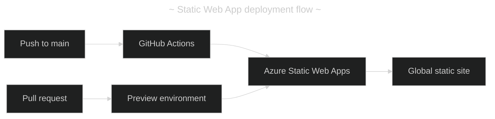

- [Azure Static Web Apps configuration lab](#azure-static-web-apps-configuration-lab)
  - [(1) Goal](#1-goal)
  - [(2) Prerequisites](#2-prerequisites)
  - [(3) Site assessment](#3-site-assessment)
  - [(4) Create the Static Web App](#4-create-the-static-web-app)
  - [(5) Validate the generated workflow](#5-validate-the-generated-workflow)
  - [(6) Verify the deployment](#6-verify-the-deployment)
  - [(7) Diagnose a missing stylesheet](#7-diagnose-a-missing-stylesheet)
  - [(8) Clean up](#8-clean-up)
  - [References](#references)

---

# Azure Static Web Apps configuration lab

## (1) Goal

Deploy the included `zen_garden` static site through GitHub Actions to Azure Static Web Apps. The lab uses a no-build HTML, CSS, and asset site to learn how Azure maps source folders to deployed files.



## (2) Prerequisites

|   # | Requirement                             | Purpose                                                | Situation   |
| --: | --------------------------------------- | ------------------------------------------------------ | ----------- |
|   1 | Azure subscription                      | Create the Static Web App resource                     | ✅ Required |
|   2 | GitHub repository                       | Hosts the `zen_garden` source                          | ✅ Required |
|   3 | GitHub repository admin or write access | Allows Azure to add the workflow and deployment secret | ✅ Required |
|   4 | `main` branch                           | Production deployment branch                           | ✅ Required |

## (3) Site assessment

The application is a plain static site. `index.html`, `style.css`, and `assets/` are all in the repository root. It has no `package.json`, framework build, output directory, or Azure Functions API.

|   # | Portal field    | Value       | Situation                                               |
| --: | --------------- | ----------- | ------------------------------------------------------- |
|   1 | Build preset    | `Custom`    | ✅ Plain static site                                    |
|   2 | App location    | `/`         | ✅ `index.html` is at the repository root               |
|   3 | API location    | Leave empty | ✅ No Azure Functions API                               |
|   4 | Output location | Leave empty | ✅ Deploy source files directly; no build folder exists |

## (4) Create the Static Web App

1. In the Azure portal, select **Create a resource**, then search for **Static Web Apps**.
2. Select **Create** and complete the **Basics** tab.

|   # | Field             | Recommended value                                             | Situation                                    |
| --: | ----------------- | ------------------------------------------------------------- | -------------------------------------------- |
|   1 | Subscription      | Your intended subscription                                    | ✅ Resource owner                            |
|   2 | Resource group    | `rg-zen-garden` or an existing learning group                 | ✅ Logical grouping                          |
|   3 | Name              | A globally unique lowercase name, such as `zen-garden-carlos` | ✅ Required by Azure                         |
|   4 | Plan type         | `Free`                                                        | ✅ Suitable for this lab                     |
|   5 | Deployment source | `GitHub`                                                      | ✅ Enables CI/CD                             |
|   6 | Organization      | The organization that owns the repository                     | ✅ Must authorize Azure access if restricted |
|   7 | Repository        | The repository containing `zen_garden`                        | ✅ Source repository                         |
|   8 | Branch            | `main`                                                        | ✅ Production branch                         |

3. Select **Next: Deployment configuration** and enter the values from section (3).
4. Select **Preview workflow file**. Do not manually replace its generated secret name.
5. In **Advanced**, leave authentication and managed API features disabled. Keep the default region unless you need a specific region for a future API or preview environments.
6. Optionally add the tags `project=zen-garden`, `environment=production`, and `owner=carlos`.
7. Select **Review + create**, then **Create**.

## (5) Validate the generated workflow

Azure creates a workflow under `.github/workflows/`. Its essential build configuration must match the following example.

```yaml
app_location: "/" # Repository root containing index.html, style.css, and assets
api_location: "" # No Azure Functions API
output_location: "" # No generated build output directory
```

The generated workflow should also include a deployment token secret with a name Azure creates, plus a pull-request job that removes preview environments after the pull request closes.

## (6) Verify the deployment

1. Open the repository’s **Actions** tab and wait for **Azure Static Web Apps CI/CD** to finish successfully.
2. In the Azure portal, open the Static Web App’s generated `*.azurestaticapps.net` URL.
3. Confirm that the page is styled and that images from `assets/` load.
4. Make a small, safe change to `zen_garden/index.html` or `zen_garden/style.css`, push it to `main`, and verify a new production deployment.
5. Open a pull request and verify that Azure creates a preview URL before merging.

## (7) Diagnose a missing stylesheet

If the HTML loads but it has no styles, inspect the browser Network panel and the deployed stylesheet URL.

|   # | Observation                                                           | Likely cause                                 | Resolution                                                         | Situation                       |
| --: | --------------------------------------------------------------------- | -------------------------------------------- | ------------------------------------------------------------------ | ------------------------------- |
|   1 | `index.html` returns `200`, but `style.css` returns `404`             | Deployment root excludes the CSS file        | Set `app_location: "/"` and leave `output_location` empty          | ❌ Incorrect deployment mapping |
|   2 | The page references `style.css`, but the repository file is elsewhere | Relative path does not match deployed layout | Update the HTML link or move the file into the deployed app folder | ❌ Incorrect asset path         |
|   3 | A framework builds files into `dist/` or `build/`                     | Output directory is not configured           | Use the framework’s real output folder in `output_location`        | 🤔 Different app type           |
|   4 | HTML and CSS both return `200`, but old styles appear                 | Browser or edge cache                        | Hard-refresh and confirm the deployed revision                     | 🤔 Caching                      |

For this lab, the stylesheet must be reachable at `https://<app-name>.azurestaticapps.net/style.css`. A successful page request by itself does not verify that static assets were deployed.

## (8) Clean up

When the lab is complete, delete the Static Web App resource or its resource group from the Azure portal to prevent retaining unused resources. Deleting the Azure resource does not delete the GitHub repository; remove the generated GitHub Actions workflow and deployment secret separately if they are no longer needed.

## References

- <https://learn.microsoft.com/azure/static-web-apps/get-started-portal>
- <https://learn.microsoft.com/azure/static-web-apps/build-configuration>
- <https://learn.microsoft.com/azure/static-web-apps/configuration>
