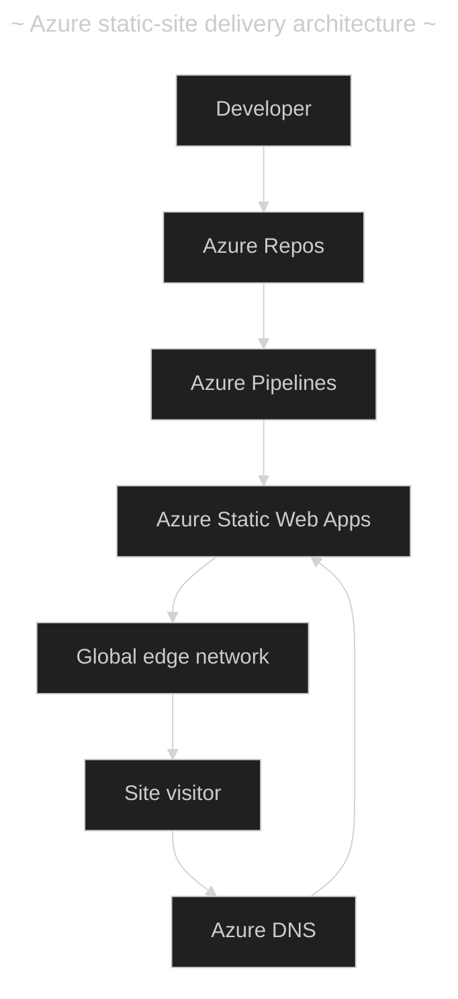
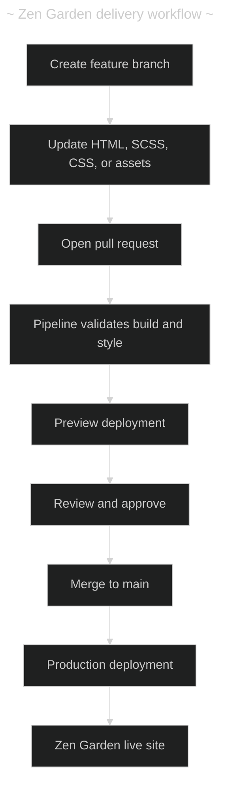
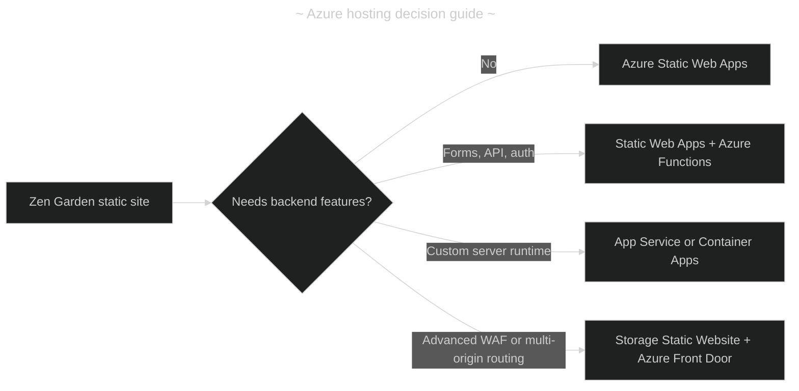

- [Azure publication plan for Zen Garden](#azure-publication-plan-for-zen-garden)
  - [Recommended services](#recommended-services)
  - [Delivery workflow](#delivery-workflow)
  - [Initial rollout](#initial-rollout)
  - [Azure alternatives](#azure-alternatives)
  - [Recommendation by stage](#recommendation-by-stage)

---

# Azure publication plan for Zen Garden

Use **Azure Static Web Apps**, **Azure DevOps Repos/Pipelines**, and **Azure DNS**.

This stack is well suited to Zen Garden because it is a static site built from HTML, CSS/SCSS, images, and SVG assets. It provides global delivery, managed HTTPS, custom domains, preview environments, and CI/CD without operating a web server.

## Recommended services

| Need                   | Azure service                        | Recommendation                                                                       |
| ---------------------- | ------------------------------------ | ------------------------------------------------------------------------------------ |
| Source control         | Azure Repos                          | Store site source, SCSS, generated CSS, assets, and deployment config together.      |
| Continuous delivery    | Azure Pipelines                      | Validate and deploy changes to `main`; create preview deployments for pull requests. |
| Hosting                | Azure Static Web Apps                | Use the Custom preset and deploy the project root if `index.html` is located there.  |
| Domain management      | Azure DNS                            | Host the DNS zone in Azure and map `www` and, if needed, the root domain.            |
| HTTPS                  | Azure Static Web Apps                | Use the included managed certificate and automatic renewal.                          |
| Site rules             | `staticwebapp.config.json`           | Configure redirects, headers, cache behavior, and a custom 404 page.                 |
| Monitoring             | Azure Monitor / Application Insights | Add uptime checks, alerts, and budget notifications after launch.                    |
| Infrastructure as code | Bicep                                | Define the resource group, Static Web App, DNS zone, and monitoring configuration.   |

## Delivery workflow

## Initial rollout

1. Create an Azure Repos Git repository and protect the `main` branch.
2. Add Sass compilation and Stylelint validation.
3. Ensure the pipeline compiles `scss/styles.scss` to `style.css` and fails if generated CSS is stale.
4. Create a dedicated resource group, such as `rg-zen-garden-prod`.
5. Create an Azure Static Web App using the Custom framework setting.
6. Configure deployment from the repository:
   - `app_location`: `/`
   - `output_location`: `/`
7. Validate the site at its generated `*.azurestaticapps.net` address.
8. Test responsive layouts, assets, links, and 404 behavior.
9. Create or transfer the domain into Azure DNS.
10. Configure `www` first, then map the apex domain if required.
11. Add `staticwebapp.config.json` for headers, redirects, caching, and error handling.
12. Add availability monitoring and a cost alert.

## Azure alternatives

| Option                              | Best fit                                                                | Trade-off                                                          |
| ----------------------------------- | ----------------------------------------------------------------------- | ------------------------------------------------------------------ |
| **Azure Static Web Apps**           | Static sites, portfolios, documentation, and this project               | Recommended: lowest operational overhead.                          |
| Storage Static Website + Front Door | Large static asset libraries or advanced edge-routing requirements      | Requires more services and setup.                                  |
| Storage Static Website only         | Temporary demos using the Azure-generated URL                           | Not suitable for a branded HTTPS domain by itself.                 |
| Azure App Service                   | Sites that will soon need server-side rendering or persistent processes | More cost and maintenance for static content.                      |
| Azure Container Apps                | A containerized application with a custom runtime                       | Unnecessary complexity for a static site.                          |
| Static Web Apps + Azure Functions   | Forms, authentication, a small API, or dynamic content                  | Keeps the static-site foundation while adding serverless features. |

## Recommendation by stage

| Stage                         | Azure footprint                                              |
| ----------------------------- | ------------------------------------------------------------ |
| Initial release               | Azure Static Web Apps Free, Azure Repos, Azure Pipelines     |
| Custom domain                 | Add Azure DNS and the managed TLS certificate                |
| Client-facing production site | Move to Static Web Apps Standard; add monitoring and budgets |
| Dynamic capabilities          | Add Azure Functions before considering a platform migration  |

Avoid Azure Front Door initially. Static Web Apps already handles globally distributed static content and managed certificates. Add Front Door only when advanced WAF controls, multi-origin failover, or sophisticated edge routing are genuinely needed.

Useful references: [Azure Static Web Apps overview](https://learn.microsoft.com/azure/static-web-apps/overview), [hosting plans](https://learn.microsoft.com/azure/static-web-apps/plans), and [configuration reference](https://learn.microsoft.com/azure/static-web-apps/configuration).
