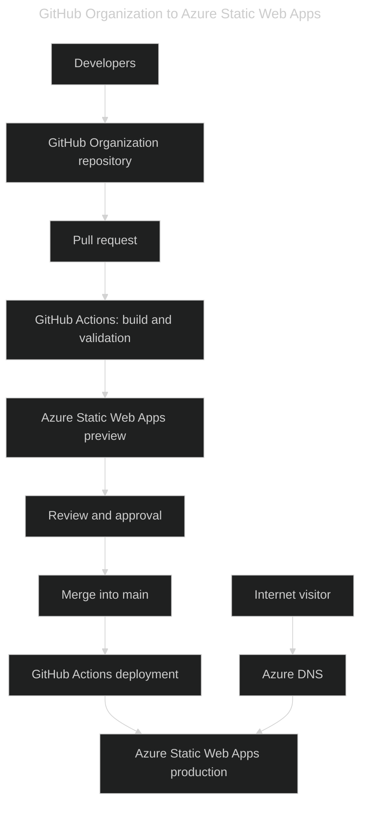
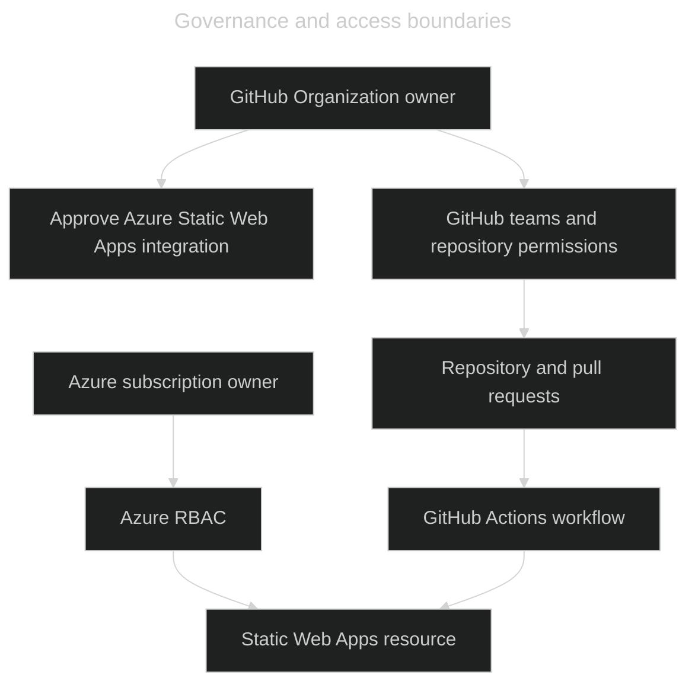

- [GitHub Organization → Azure](#github-organization--azure)
  - [Recommended setup](#recommended-setup)
  - [Organization authorization](#organization-authorization)
  - [Security model](#security-model)
  - [Does this still count as “always Azure”?](#does-this-still-count-as-always-azure)

---

# GitHub Organization → Azure

Yes—this is the recommended approach when your organization already uses GitHub. GitHub manages source control and deployment triggers, while Azure provides hosting, DNS, TLS, and monitoring.

Azure Static Web Apps can connect directly to a GitHub Organization repository. During setup, select the organization, repository, and production branch. Azure then creates a GitHub Actions workflow that deploys changes to the Static Web App.

[Azure Static Web Apps quickstart](https://learn.microsoft.com/en-us/azure/static-web-apps/get-started-portal?pivots=github&tabs=vanilla-javascript)

## Recommended setup

| Area                  | Recommendation                                                                                                     |
| --------------------- | ------------------------------------------------------------------------------------------------------------------ |
| Repository            | `github.com/<organization>/zen-garden`                                                                             |
| Production branch     | Protect `main`; require pull requests and passing workflow checks.                                                 |
| Production deployment | Deploy only after changes are merged into `main`.                                                                  |
| Pull requests         | Use Static Web Apps preview environments for visual review before merging.                                         |
| Azure resources       | Use a dedicated resource group for Static Web Apps, Azure DNS, and optional Application Insights.                  |
| Access control        | Use GitHub teams for repository access and Azure RBAC for Azure resources.                                         |
| Secrets               | Store the generated Static Web Apps deployment token in GitHub Actions secrets; never commit it to source control. |
| Infrastructure        | Define Azure resources in Bicep and deploy them through a separate infrastructure workflow.                        |

## Organization authorization

A GitHub Organization owner may need to approve the **Azure Static Web Apps** GitHub OAuth application before organization repositories appear in the Azure portal. This is expected when the organization restricts third-party application access.

[Microsoft guidance](https://learn.microsoft.com/en-us/azure/static-web-apps/get-started-portal?pivots=github&tabs=vanilla-javascript)

## Security model

Use separate deployment identities for application delivery and infrastructure changes.

| Workload                                              | Authentication                                            | Rationale                                                                                                                               |
| ----------------------------------------------------- | --------------------------------------------------------- | --------------------------------------------------------------------------------------------------------------------------------------- |
| Static-site deployment                                | Generated `AZURE_STATIC_WEB_APPS_API_TOKEN` GitHub secret | Standard Static Web Apps deployment mechanism. Rotate the token in Azure if exposure is suspected.                                      |
| Infrastructure changes, including Bicep and Azure DNS | GitHub Actions OIDC federation with Microsoft Entra ID    | Avoids long-lived Azure credentials in GitHub. Restrict federation to the specific organization, repository, and branch or environment. |

- [Deployment token guidance](https://learn.microsoft.com/en-us/azure/static-web-apps/deployment-token-management)
- [OIDC with Azure](https://docs.github.com/en/actions/how-tos/secure-your-work/security-harden-deployments/oidc-in-azure)

## Does this still count as “always Azure”?

Yes—if “always Azure” means that the public application and its cloud resources run on Azure.

| Model                       | Source control and CI/CD      | Public hosting        | Best fit                                                           |
| --------------------------- | ----------------------------- | --------------------- | ------------------------------------------------------------------ |
| GitHub Organization + Azure | GitHub + GitHub Actions       | Azure Static Web Apps | Recommended when the organization already uses GitHub.             |
| Azure DevOps + Azure        | Azure Repos + Azure Pipelines | Azure Static Web Apps | Use when source control and pipelines must remain in Azure DevOps. |

Azure Static Web Apps supports both GitHub and Azure DevOps integrations. [Hosting plan comparison](https://learn.microsoft.com/azure/static-web-apps/plans)

For this project, use the GitHub Organization repository, protect `main`, deploy through GitHub Actions to Azure Static Web Apps, and manage the public domain with Azure DNS.
